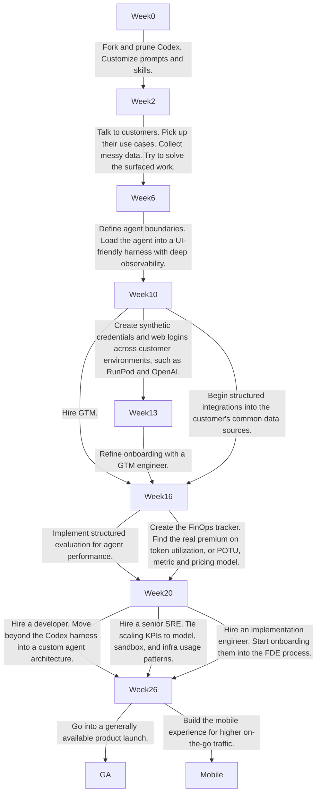

# Flowchart

```mermaid
flowchart TD
  Week0 --> |Fork and prune Codex. Customize prompts and skills.| Week2
  Week2 --> |Talk to customers. Pick up their use cases. Collect messy data. Try to solve the surfaced work.| Week6
  Week6 --> |Define agent boundaries. Load the agent into a UI-friendly harness with deep observability.| Week10
  Week10 --> |Hire GTM.| Week16
  Week10 --> |Create synthetic credentials and web logins across customer environments, such as RunPod and OpenAI.| Week13
  Week13 --> |Refine onboarding with a GTM engineer.| Week16
  Week10 --> |Begin structured integrations into the customer's common data sources.| Week16
  Week16 --> |Implement structured evaluation for agent performance.| Week20
  Week16 --> |Create the FinOps tracker. Find the real premium on token utilization, or POTU, metric and pricing model.| Week20
  Week20 --> |Hire a developer. Move beyond the Codex harness into a custom agent architecture.| Week26
  Week20 --> |Hire a senior SRE. Tie scaling KPIs to model, sandbox, and infra usage patterns.| Week26
  Week20 --> |Hire an implementation engineer. Start onboarding them into the FDE process.| Week26
  Week26 --> |Go into a generally available product launch.| GA
  Week26 --> |Build the mobile experience for higher on-the-go traffic.| Mobile
```
